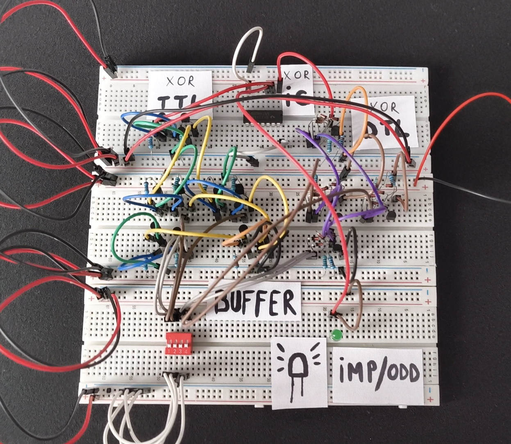
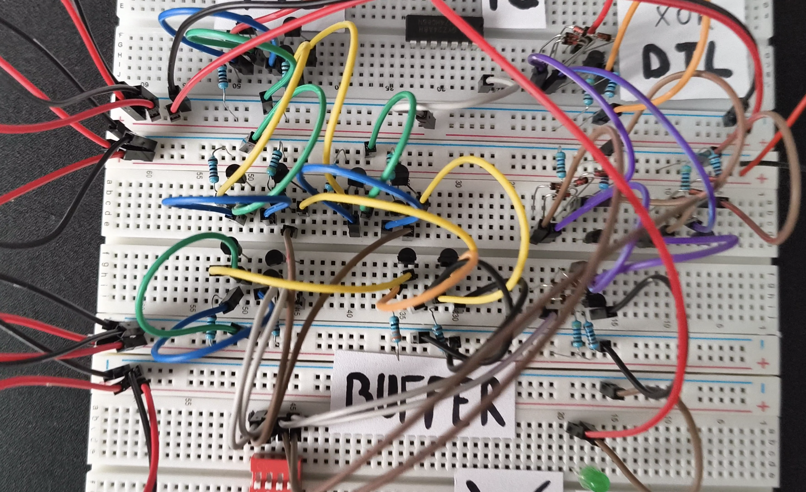
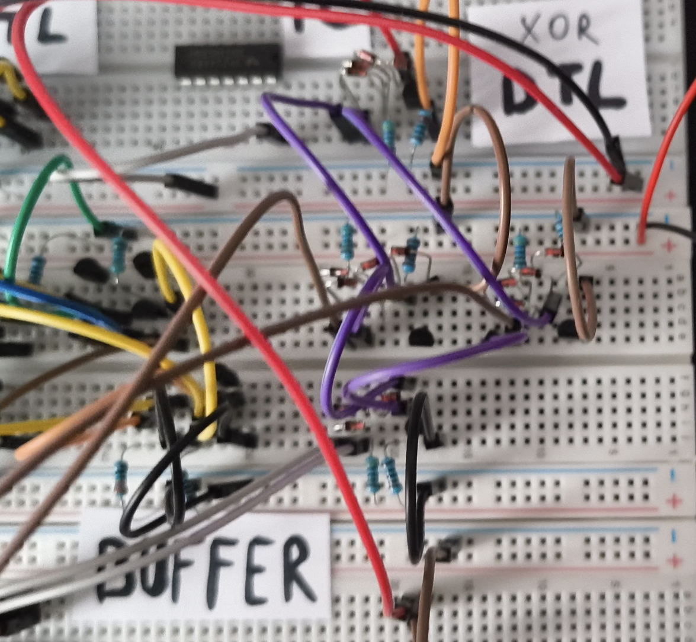
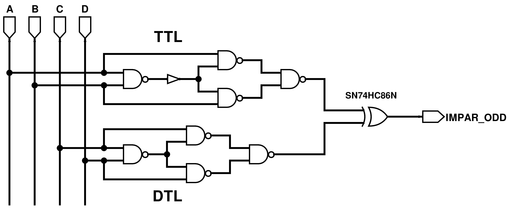
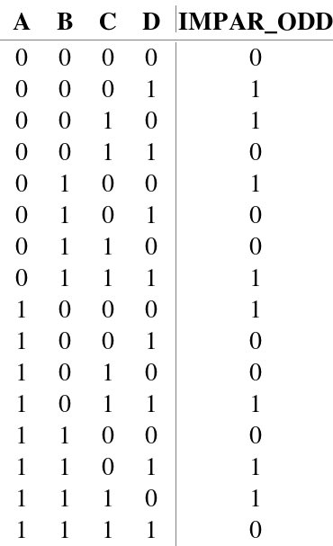
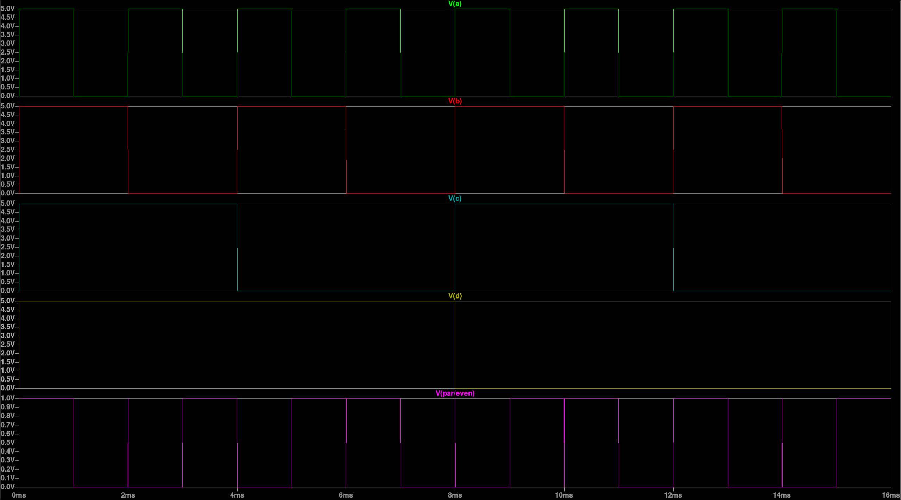

# P01 — 4-bit Odd Parity Detector (TTL + DTL + IC)

<div align="center">


[← Back to projects list](../../README.md)

</div>

---

## Description

4-bit odd parity detector with inputs **(A, B, C, D)**, built using **three different XOR implementation technologies** on the same breadboard:

- **XOR #1** — 4 NAND gates hand-built from transistors and resistors in **TTL** (Transistor-Transistor Logic) technology
- **XOR #2** — 4 NAND gates hand-built from diodes and resistors in **DTL** (Diode-Transistor Logic) technology
- **XOR #3** — Commercial IC **SN74HC86N**

Output: **LED on** when the number of `1` bits at the input is **odd**, **LED off** when even.

The goal was to understand how logic gates are built from scratch and compare the three technologies on the same real circuit.

---

## 📷 Physical Build

> *(Add your photos to `photos/` and replace the placeholders)*

| Overview | TTL detail | DTL detail |
|:--------------------------:|:------------------------:|:------------------------:|
|  |  |  |

---

## 🔧 Components Used

### XOR #1 — TTL Technology (NAND from transistors)

| Component | Value | Role |
|-----------|-------|------|
| NPN Transistors | BC547 × 10 | TTL NAND gates |
| NPN Transistors | 2N2222 × 2 | Multi-emitter transistor in last TTL NAND gate |
| Base resistors | 4.7 kΩ × 4 | Base current limiting |
| Collector resistors | 1 kΩ × 4 | Collector pull-up |
| Buffer | 2N2222 × 2, 330 Ω × 1, 1 kΩ × 1 | Fanout problem fix |

### XOR #2 — DTL Technology (NAND from diodes + transistor)

| Component | Value | Role |
|-----------|-------|------|
| Diodes | 1N4148 × 16 | DTL NAND gates |
| NPN Transistors | 2N2222 × 4 | DTL NAND gates |
| Pull-up resistors | 4.7 kΩ × 4 | Diode input pull-up |
| Base resistors | 4.7 kΩ × 4 | Base current limiting |
| Collector resistors | 1 kΩ × 4 | Collector pull-up |

### XOR #3 — Commercial IC

| Component | Value | Role |
|-----------|-------|------|
| SN74HC86N | Quad XOR IC | Third XOR (combining partial results) |
| Green LED | — | Odd parity indicator |

### Power Supply

| Parameter | LTspice Simulation | Real (breadboard) |
|-----------|--------------------|-------------------|
| VCC | 5 V | ~7–8 V (9V battery under load) |

---

## 📐 Logic Diagram

> *(Add the Logisim schematic to `schematic/schematic.png`)*

```
A ──┐
    ├─ XOR #1 (TTL) ──┐
B ──┘                  ├─ XOR #3 (SN74HC86N) ── LED
C ──┐                  │
    ├─ XOR #2 (DTL) ──┘
D ──┘
```



---

## 📊 Truth Table (4 bits, odd parity)

> Output = 1 (LED on) when the number of `1` bits is **odd**

| A | B | C | D | No. of 1s | Parity | Output (LED) |
|:-:|:-:|:-:|:-:|:---------:|:------:|:------------:|
| 0 | 0 | 0 | 0 | 0 | Even | 0 ⚫ |
| 0 | 0 | 0 | 1 | 1 | **Odd** | **1 🟢** |
| 0 | 0 | 1 | 0 | 1 | **Odd** | **1 🟢** |
| 0 | 0 | 1 | 1 | 2 | Even | 0 ⚫ |
| 0 | 1 | 0 | 0 | 1 | **Odd** | **1 🟢** |
| 0 | 1 | 0 | 1 | 2 | Even | 0 ⚫ |
| 0 | 1 | 1 | 0 | 2 | Even | 0 ⚫ |
| 0 | 1 | 1 | 1 | 3 | **Odd** | **1 🟢** |
| 1 | 0 | 0 | 0 | 1 | **Odd** | **1 🟢** |
| 1 | 0 | 0 | 1 | 2 | Even | 0 ⚫ |
| 1 | 0 | 1 | 0 | 2 | Even | 0 ⚫ |
| 1 | 0 | 1 | 1 | 3 | **Odd** | **1 🟢** |
| 1 | 1 | 0 | 0 | 2 | Even | 0 ⚫ |
| 1 | 1 | 0 | 1 | 3 | **Odd** | **1 🟢** |
| 1 | 1 | 1 | 0 | 3 | **Odd** | **1 🟢** |
| 1 | 1 | 1 | 1 | 4 | Even | 0 ⚫ |

---

## 📊 Simulations

### Logisim Evolution

> *(Add the Logisim truth table screenshot to `schematic/truth_table.png`)*



Logisim circuit file: [`schematic/circuit.circ`](./schematic/circuit.circ)

### LTspice

> *(Add the LTspice simulation screenshot to `simulation/simulation_output.png`)*



LTspice file: [`simulation/circuit.asc`](./simulation/circuit.asc)

---

## 💡 How It Works

### Parity detection principle

The **XOR** gate has a fundamental property:

```
A XOR B = 1  if  A ≠ B
A XOR B = 0  if  A = B
```

By chaining three XOR gates:

```
Stage 1:  P1 = A XOR B          (XOR #1 — TTL)
Stage 2:  P2 = C XOR D          (XOR #2 — DTL)
Stage 3:  OUT = P1 XOR P2       (XOR #3 — SN74HC86N)
```

The final output is `1` exactly when the total number of `1` bits is odd.

### Building XOR from NANDs

An XOR can be built from **4 NAND gates**:

```
XOR(A,B) = NAND( NAND(A, NAND(A,B)), NAND(B, NAND(A,B)) )
```

This formula was physically implemented in both TTL and DTL.

### Technology comparison

| Feature | TTL | DTL | IC (74HC86N) |
|---------|-----|-----|--------------|
| Active components | NPN Transistors | Diodes + Transistor | — (integrated) |
| Speed | Medium | Slow | High |
| Fanout | Low ⚠️ | Low | High |
| Power consumption | High | Medium | Very low |
| Build complexity | High | Medium | Very low |

---

## ⚠️ Issues Encountered

### Issue: Low TTL fanout

**Symptom:** The NAND #1 (TTL) output could not directly drive the NAND #2 and NAND #3 inputs — the output voltage dropped below the `HIGH` logic threshold.

**Cause:** BC547 transistors in TTL configuration have low fanout — the available output current was insufficient to maintain the correct logic level at the IC input.

**Solution:** Added a **Buffer** (2 × 2N2222 in common-emitter configuration connected in series) between the NAND #1 output and the NAND #2 and NAND #3 inputs, which restored the correct logic level.

✅ After adding the buffer, the circuit worked correctly.

### Issue: Battery voltage drop under load

**Symptom:** The 9V battery dropped to ~7–8V when connected to the breadboard.

**Cause:** Internal battery resistance + parasitic resistance of the breadboard wires.

**Note:** The circuit worked correctly at this voltage as well, since TTL and DTL are tolerant to supply variations, and the SN74HC86N operates in the 2V–6V range; only in simulation was 5V used.

### Hardware constraint

> ⚠️ Implementation was limited to 10 BC547 and 10 2N2222 transistors, which directly influenced the topology choices and component distribution between the two technologies (TTL and DTL).

---

## 📚 Lessons Learned

- **XOR from NANDs** — how to derive the formula and implement it physically, in both TTL and DTL
- **TTL technology** — NPN transistors as digital switches, logic thresholds, base/collector currents
- **DTL technology** — diodes as hardware AND gates, completed with an inverter transistor
- **Fanout problem** — why TTL has low fanout and how to fix it with a buffer
- **Technology comparison** — practical differences between TTL, DTL and IC on the same circuit
- **Battery internal resistance** — why voltage drops under load and how it affects the circuit

---

<div align="center">

[← Back](../../README.md) · [⬆ Top](#p01--4-bit-odd-parity-detector-ttl--dtl--ic)

</div>
